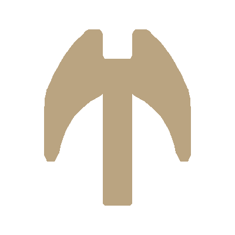

# <ins>Custom Chat</ins>

An application that creates a custom AI chatbot for businesses based on documents and finetuning provided.

<ins>**NOTICE**</ins>

At the moment, this app is in development. Thank you for understanding.

## Table of Contents

* <ins>Use Guide</ins>
    * [Getting Started](#getting-started)
    * [How To Start Up](#start-up)
    * [How To Use The App](#use-app)
    * [How to Close Down the App](#close-app)
    * [Things To Be Aware Of](#aware-of)
    * [Ideas for Further Work](#further-work)
    * [Other Dependencies](#other-dependencies)
    * [Contributors & Acknowledgements](#contrib-acknow)
    * [Contribution Guidelines](#contrib-guidelines)
    * [License](#license)

# <ins>Use Guide</ins>

## <a name="#getting-started">Getting Started</a>

.

## <a name="#start-up">How To Start Up</a>

.

## <a name="#use-app">How To Use The App</a>

.

## <a name="#close-app">How to Close Down the App</a>

.

## <a name="#aware-of">Things To Be Aware Of</a>

.

## <a name="#further-work">Ideas for Further Work</a>

.

## <a name="#other-dependencies">Other Dependencies</a>

.

## <a name="#contrib-acknow">Contributors & Acknowledgements</a>

This app was created by myself (BenWrightSWE).

## <a name="#contrib-guidelines">Contribution Guidelines</a>

Follow the license guideline and please message me regarding any changes you may have made. I'd love to hear about them
and implement them in this version after checking them out.

## <a name="#license">License</a>

For this project I am using the AGPL-3.0 license. Please respect this.

If you want further information regarding the license go to the LICENSE file.

